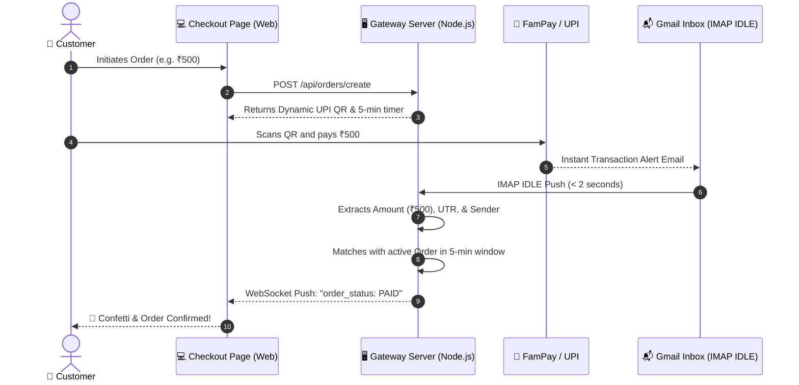

# ⚡ Personal UPI Gateway (FamPay & Bank IMAP IDLE)

A self-hosted, 0% transaction fee personal UPI payment gateway powered by **Gmail/IMAP IDLE real-time email push** and **Time-Window + Amount Matching**.

> **No aggregator fees (0% fee). No dedicated 24x7 Android phone required.** Payments go directly into your bank / FamPay account.

---

## 🌟 Key Features

- **⚡ Real-Time IMAP IDLE Push:** Listens to incoming transaction alerts from **FamPay**, **FamApp**, and Indian banks via IMAP IDLE. Latency is under 2–3 seconds with zero continuous polling overhead.
- **🕒 Time-Window + Amount Matching:** Automatically pairs incoming payments with active 5-minute checkout sessions without forcing customers to manually type 12-digit UTR numbers.
- **🛡️ Duplicate & Fraud Prevention:** UTR locking ensures no transaction reference or payment email can be claimed more than once.
- **📲 Dynamic UPI Checkout Page:** Modern glassmorphism dark theme with dynamic UPI QR codes, live countdown timer, confetti celebration, audio chime, and 1-tap mobile intent links (Google Pay, PhonePe, Paytm, FamPay).
- **🕹️ Admin Dashboard & Simulator:** Real-time analytics, order tracking, live payment feed, and an interactive **Payment Simulator** to test matching logic without sending real money.
- **🔍 Self-Healing & Fallbacks:** If an email alert is delayed, customers can enter their 12-digit UTR to immediately claim and verify the order.
- **📡 Webhook Integration:** Fires asynchronous HTTP POST webhooks to your merchant store / website when payment succeeds.

---

## 🏗️ Architecture Flow



---

## 🚀 Quick Start

### 1. Clone the repository
```bash
git clone https://github.com/harshygs-blip/payment-gateway.git
cd payment-gateway
```

### 2. Install dependencies
```bash
npm install
```

### 3. Configure Environment Variables
Copy `.env.example` to `.env`:
```bash
cp .env.example .env
```

Edit `.env`:
```env
PORT=3000
MERCHANT_UPI_VPA=yourname@fam
MERCHANT_NAME=Personal Gateway
ORDER_EXPIRY_MINUTES=5

# Gmail IMAP Configuration (Requires 2-Step Verification + App Password)
IMAP_ENABLED=true
IMAP_HOST=imap.gmail.com
IMAP_PORT=993
IMAP_USER=your_email@gmail.com
IMAP_PASS=your_16_char_google_app_password
IMAP_SENDER_FILTER=fampay,famapp,alerts
```

> **How to get a Google App Password:**
> 1. Go to your [Google Account Security](https://myaccount.google.com/security) and turn **2-Step Verification ON**.
> 2. Visit [Google App Passwords](https://myaccount.google.com/apppasswords).
> 3. Generate a password for `Personal Gateway` (16 letters, e.g. `abcd efgh ijkl mnop`).
> 4. Paste it into `IMAP_PASS`.

### 4. Start the server
```bash
npm start
```
- **Admin Dashboard:** `http://localhost:3000/admin`
- **Checkout Demo:** Generated on order creation

---

## 🧪 Testing Tools

### Run Unit & Integration Tests
```bash
# Test FamPay regex parser
npm test

# Test database & matching engine
npm run test:integration
```

### Test Live IMAP Connection from Terminal
```bash
node scripts/testImap.js
```

---

## 🏛️ Enterprise Backend Architecture

The backend follows clean, modular design principles with strict separation of concerns:

```
personal-gateway/
├── server.js               # Clean application bootstrap & graceful shutdown
├── config.js               # Centralized configuration defaults
├── Dockerfile              # Multi-stage production container
├── .dockerignore           # Optimized build ignore rules
├── db/
│   └── database.js         # SQLite database schema, helpers & connection pooling
├── src/
│   ├── app.js              # Express app factory with middleware orchestration
│   ├── controllers/        # Request handlers & response formatters
│   │   ├── admin.controller.js
│   │   ├── imap.controller.js
│   │   ├── ledger.controller.js
│   │   └── order.controller.js
│   ├── models/             # Data Access Objects (DAOs) & DB query logic
│   │   ├── order.model.js
│   │   ├── payment.model.js
│   │   └── setting.model.js
│   ├── routes/             # Versioned REST API routing layer (/api & /api/v1)
│   │   ├── index.js
│   │   ├── admin.routes.js
│   │   ├── health.routes.js
│   │   └── order.routes.js
│   ├── middlewares/        # Express pipeline middlewares
│   │   ├── errorHandler.js # Standardized JSON errors & 404 handler
│   │   └── requestLogger.js# Request performance & response timing logger
│   ├── services/           # Core domain logic
│   │   ├── emailParser.service.js
│   │   ├── imapListener.service.js
│   │   └── matchingEngine.service.js
│   ├── jobs/               # Background scheduled jobs
│   │   └── expiryCleaner.job.js
│   ├── sockets/            # Real-time WebSocket connection & room handlers
│   │   └── socketHandler.js
│   └── utils/              # Shared utilities
│       ├── logger.js
│       └── qr.util.js
├── public/                 # Glassmorphic Admin Dashboard & Checkout frontend
└── tests/                  # Automated unit and integration test suites
```

---

## 🐳 Docker & Cloud Deployment

### 1. Run with Docker
```bash
docker build -t personal-upi-gateway .
docker run -d -p 3000:3000 -v $(pwd)/data:/app/data --name upi-gateway personal-upi-gateway
```

### 2. Cloud PaaS (Render, Railway, Fly.io, Koyeb)
- **Build Type**: Docker or Node.js
- **Start Command**: `npm start`
- **Health Check Path**: `/health` (returns `200 OK` with database and IMAP status)
- **Port**: `3000` (or dynamic `$PORT`)

---

## 📡 API Reference

### 1. System Health Check
```http
GET /health
```
**Response:**
```json
{
  "status": "OK",
  "timestamp": "2026-09-03T23:17:29.350Z",
  "uptime": "0h 5m 12s",
  "database": { "engine": "SQLite", "status": "HEALTHY" },
  "imap": { "enabled": true, "connected": true, "listening": true }
}
```

### 2. Create Checkout Session (Protected by API Key)
```http
POST /api/orders/create
Content-Type: application/json
x-api-key: pg_live_your_api_key_here

{
  "amount": 500.00,
  "customerName": "Rahul Sharma",
  "customerPhone": "9876543210",
  "webhookUrl": "https://your-site.com/api/payment-webhook"
}
```

**Response:**
```json
{
  "success": true,
  "order": {
    "orderCode": "ORD-3353VZ",
    "amount": 500,
    "checkoutUrl": "/checkout/ORD-3353VZ",
    "upiUri": "upi://pay?pa=yourname@fam&pn=Personal%20Gateway&am=500.00&cu=INR&tn=Order%20ORD-3353VZ"
  }
}
```

### 3. Webhook Payload (Dispatched to your `webhookUrl`)
```json
{
  "event": "payment.success",
  "data": {
    "orderCode": "ORD-3353VZ",
    "amount": 500,
    "utr": "214771578746",
    "sender": "MEENA KUMARI",
    "paidAt": 1788475800000
  }
}
```

---

## 📄 License
ISC License. Free for personal and commercial use.

